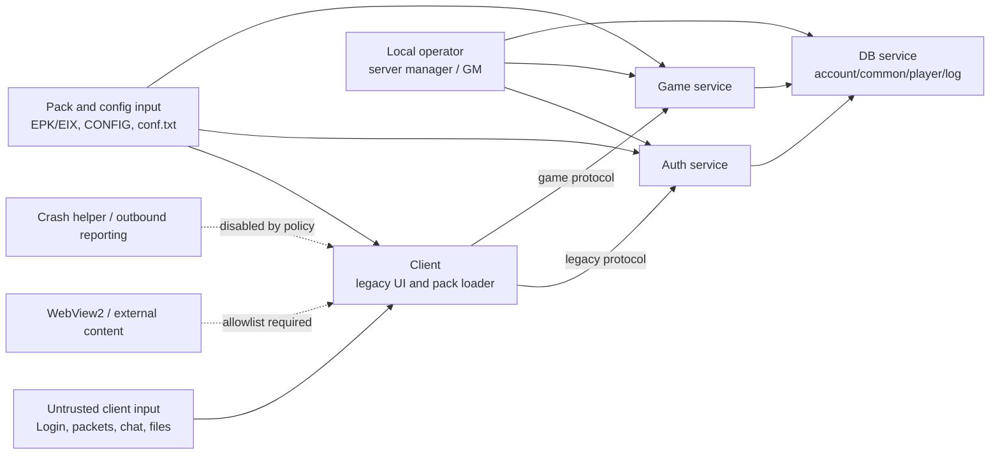

# Metin2 Modernization 2026 · Security Model

Stand: 2026-08-01  
Scope: Gate 030, lokaler Windows-Workspace, Git-freier Nachweis

Dieses Modell beschreibt die Vertrauensgrenzen und die offenen Kontrollen. Es
ist keine Freigabe für einen öffentlichen Betrieb. Die Security-Prüfung hat
keine Datenbank, keinen Serverprozess, keinen Client und kein Packwerkzeug
verändert.

## Vertrauensgrenzen

### Zonen

| Zone | Inhalt | Vertrauensannahme |
|---|---|---|
| Z0 | Client, Launcher, Pack-/Config-Dateien, Netzwerkpakete | vollständig manipulierbar; niemals Autorität für Wirtschaft, Rechte oder Löschung |
| Z1 | Auth/Game/DB-Prozessgrenzen | nur validierte, versionierte Nachrichten; Authentisierung und Rate-Limits serverseitig |
| Z2 | MariaDB-Schemas und Kontodaten | Credentials getrennt injizieren; pro Prozess minimale Rechte; auditierbare Migrationen |
| Z3 | Lokaler Operator/GM | starke Identität, RBAC, nachvollziehbare Aktionen; IP allein ist kein ausreichender Faktor |
| Z4 | WebView2, Crashreporting, externe Endpunkte | standardmäßig blockiert; explizite Allowlist, Telemetrie-Minimierung und opt-in |

## Top-Risiken und Kontrollen

| ID | Risiko | Owner | Aktueller Nachweis | Zielkontrolle / Testidee |
|---|---|---|---|---|
| SEC-001 | DB-Zugangsdaten stehen in Runtime-Konfigurationen und Setup-Skripten | Server/Ops | Security-Audit: 43 redigierte Secret-Treffer in 15 Konfigurations-/Setup-Dateien | lokale Secret-Injektion, Startvalidator; Repository-/Pack-Scan muss ohne Produktionscredential passieren |
| SEC-002 | Root- und Laufzeit-DB-Zugänge sind für die lokale Angriffsfläche zu breit | DB/Ops | `root@%` hat `ALL ON *.*` plus `GRANT OPTION`; `metin2@%` hat keine globalen Rechte, aber `ALL` auf `account`, `common`, `player`, `log` | Root auf Initialisierung begrenzen; getrennte Rollen für Auth/Game/DB/Log; Restore- und Negativtests je Queryklasse |
| SEC-003 | Legacy-Login transportiert Passwortfelder und berechnet SQL-`PASSWORD()` | Auth/Protocol | `packet.h`, `input_auth.cpp`, `AccountConnector.cpp` | versionierter Login-Handshake, moderne Passwortmigration, kein Klartext-/Legacy-Fallback nach Ablauf |
| SEC-004 | Charakterlöschung nutzt Legacy-Private-Code, Levelgrenzen und DB-Delete-Pfad | Account/Game | `ClientManagerPlayer.cpp`, `TPacketPlayerDelete` | Re-Authentisierung, serverseitige Besitzprüfung, Cooldown, Audit-Journal, transaktionale/idempotente Löschung |
| SEC-005 | GM-Rechte werden aus `gmlist`, Authority-Strings und Host-IP geladen; `test_server` setzt den GM-Level global auf Implementor | Admin/Server | `ClientManager.cpp`, `gm.cpp`, `char.cpp`, `cmd.cpp` | Produktionsstart bei Testflag hart abbrechen; zentraler RBAC-/Permission-Katalog, Deny-by-default, Rechte- und Audit-Tests |
| SEC-006 | Missbrauchsschutz ist nicht als einheitliche Policy nachgewiesen; Slash-Kommandos umgehen den normalen Chat-Counter, hohe Level umgehen Spam-Scoring | Auth/Game | `input_main.cpp` trennt Command-Dispatch und Spamprüfung | IP-/Account-/Session-Limits, Backoff und Abuse-Tests; Ausnahmen nur über explizite Rollen |
| SEC-007 | Viele SQL-Zugriffe sind formatierte `DirectQuery`/`ReturnQuery`-Pfade; Quest-Lua-APIs und Multi-Statements erweitern die Oberfläche | DB/Server | Audit zählt 80 repräsentative Treffer; einzelne Pfade escapen Eingaben, aber kein zentraler Prepared-Statement-Vertrag | Query-Wrapper, typisierte Parameter, Multi-Statements nur wenn begründet, negative SQL-Injection-Tests und Query-Allowlist |
| SEC-008 | Crashpfad startet `errorlog.exe`; weitere Shell-/Lua-Prozesspfade und Client-Python-Ausführung bestehen | Client/Runtime | `error.cpp:215`, `libthecore/src/log.c`, `liblua/src/lib/liolib.c`, `PythonLauncher.cpp` | keine stillen Prozessstarts; absolute/allowlistete Pfade, Produktions-Lua ohne `io.execute`, signierte Pack-/Scriptquelle |
| SEC-009 | WebView2 navigiert externe URLs ohne erkennbare Allowlist, HTTPS- oder Download-Policy | Client/UI | `CWebBrowser.cpp` ruft `Navigate` mit übergebenem `addr` auf; UI enthält Wiki-/Mall-HTTP-Ziele | Navigation, Schemes, Downloads, Permissions und externe Ziele explizit allowlisten; Fixture-Test für blockierte Ziele |
| SEC-010 | Binaries/Packtools und Architekturvertrauen sind nicht vollständig releasefest | Release/Ops | PE-/Hash-Inventur vorhanden; x86-`libmysql.dll` neben x64-Zielen; PackMakerLite mit System32/Registry-Helfern isoliert | signierte/manifestierte Artefakte, Architektur-Gate, reproduzierbare Pack-Hashes, keine Registry-Installation |

## Gate-Entscheidungen

1. Lokaler Betrieb bleibt Loopback-only; die bestehende Gate-020-Entscheidung
   wird nicht aufgeweicht.
2. Credentials, DB-Grants, Passwortprotokoll, Löschlogik und GM-Rechte werden
   nicht blind in einem Sammelpatch geändert. Jeder Umbau erhält einen
   Migrationsplan, Backup-/Restore-Nachweis und Negativtests.
3. MSM bleibt ein späteres Asset-Gate. Dieses Security-Modell behandelt Packs
   als untrusted input; es ersetzt nicht die geplante CSV-/JSON-Migration.
4. UI-Rewrite und Renderer bleiben nachgelagerte Gates. WebView2 wird dabei
   nur als explizit begrenzte Client-Grenze weitergeführt.

## Nachweise

- Read-only Audit: `C:/Dev/M2Lead/_local/modernization-2026/runs/gate030-security-inventory/security-audit.json`
- Gate-020 Build-/Runtime-Nachweise: `C:/Dev/M2Lead/_local/modernization-2026/runs/`
- Bestehende lokale Sicherheitsinventur: `docs/windows-local/SECURITY_AUDIT.md`
- DB-/Loopback-Entscheidungen: `docs/windows-local/DECISIONS.md`
